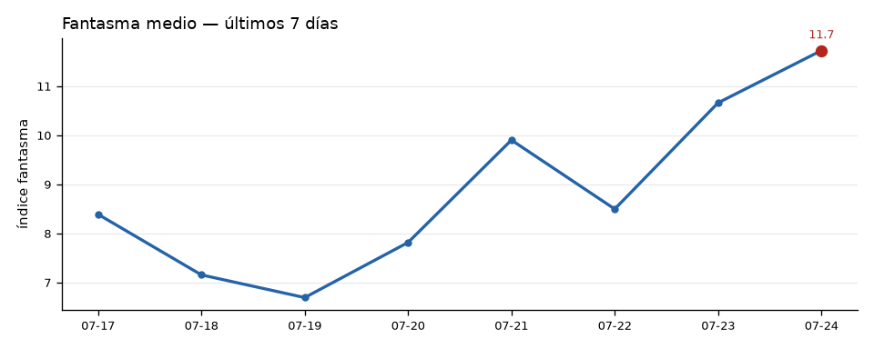

# 🔄 Comparativo diario — 2026-07-24 vs 2026-07-23
*Corte 00:32 hora MX*

| Métrica | Hoy | Ayer | Cambio |
|---|---:|---:|---:|
| Fantasma medio | 11.7 | 10.7 | ▲ +1.1 |
| Fantasma máx | 11.9 | 12.5 | ▼ -0.6 |
| Ciclos corridos | 2 | 8 | ▼ -6 |
| Breaches del Muro | 1 | 0 | ▲ +1 |
| Asertividad viva (resuelta en el día) | — | — | — |
| Patrones cimáticos (total / nuevos 24h) | 264 | — | +26 |

