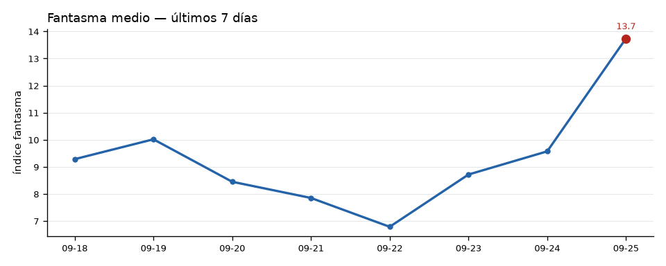

# 🔄 Comparativo diario — 2026-08-11 vs 2026-08-10
*Corte 01:18 hora MX*

| Métrica | Hoy | Ayer | Cambio |
|---|---:|---:|---:|
| Fantasma medio | 10.7 | 11.2 | ▼ -0.5 |
| Fantasma máx | 10.9 | 11.7 | ▼ -0.7 |
| Ciclos corridos | 4 | 11 | ▼ -7 |
| Breaches del Muro | 4 | 6 | ▼ -2 |
| Asertividad viva (resuelta en el día) | — | — | — |
| Patrones cimáticos (total / nuevos 24h) | 690 | — | +37 |

