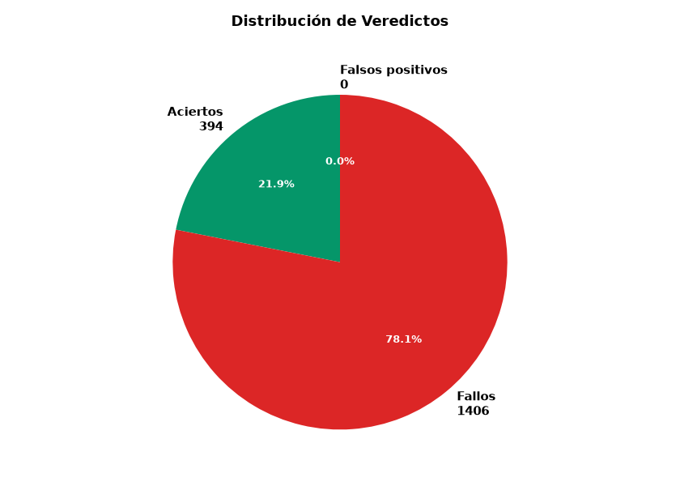
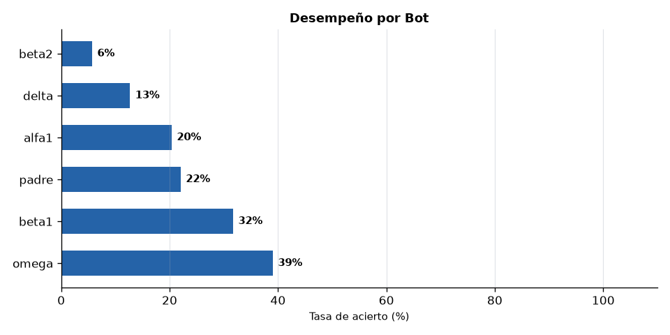

# 🔄 Comparativo diario — 2026-09-25 vs 2026-09-24
*Corte 12:26 hora MX*

| Métrica | Hoy | Ayer | Cambio |
|---|---:|---:|---:|
| Fantasma medio | 13.7 | 9.6 | ▲ +4.2 |
| Fantasma máx | 15.5 | 14.9 | ▲ +0.6 |
| Ciclos corridos | 10 | 12 | ▼ -2 |
| Breaches del Muro | 0 | 0 | ＝ +0 |
| Asertividad viva (resuelta en el día) | — | — | — |
| Patrones cimáticos (total / nuevos 24h) | 1631 | — | +29 |

## ✅ Aciertos — Últimas 24 horas

| Métrica | Valor |
|---------|-------|
| **Aciertos** | 394 |
| **Fallos** | 1406 |
| **Falsos positivos** | 0 |
| **Tasa de acierto** | 21.9% `▓▓▓░░░░░░░░░` |
| **Total predicciones** | 1800 |

### 🤖 Desempeño por Bot

| Bot | Aciertos | Tasa | Confianza | Ventana declarada |
|-----|----------|------|-----------|--------------------|
| omega | 117/300 | 39% `▓▓▓░░░░░` | 0.39 | 0.0h |
| beta1 | 95/300 | 32% `▓▓▓░░░░░` | 0.32 | 0.0h |
| padre | 66/300 | 22% `▓▓░░░░░░` | 0.22 | 0.0h |
| alfa1 | 61/300 | 20% `▓▓░░░░░░` | 0.20 | 0.0h |
| delta | 38/300 | 13% `▓░░░░░░░` | 0.13 | 0.0h |
| beta2 | 17/300 | 6% `░░░░░░░░` | 0.06 | 0.0h |

