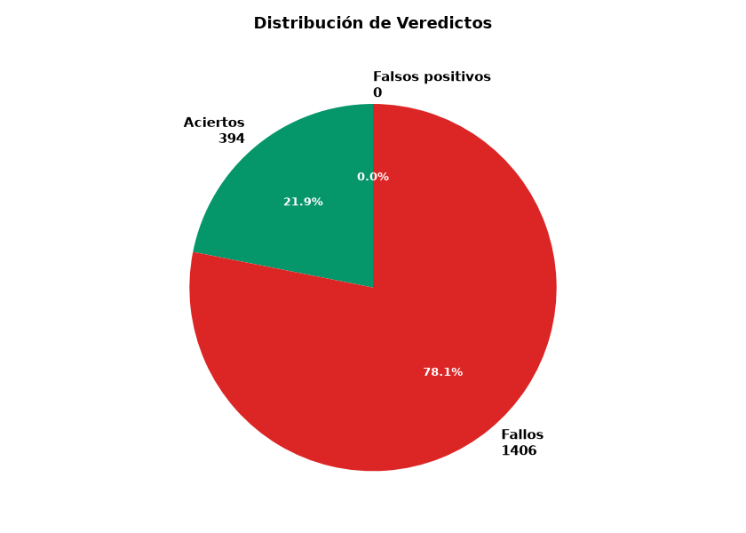
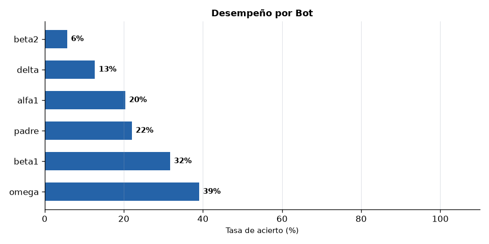
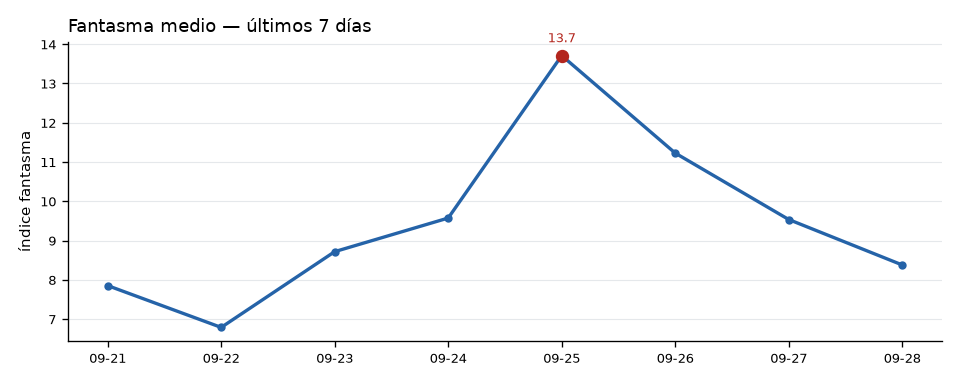

# 🔄 Comparativo diario — 2026-09-26 vs 2026-09-25
*Corte 00:01 hora MX*

| Métrica | Hoy | Ayer | Cambio |
|---|---:|---:|---:|
| Fantasma medio | 13.2 | 14.0 | ▼ -0.8 |
| Fantasma máx | 14.1 | 16.3 | ▼ -2.2 |
| Ciclos corridos | 65 | 287 | ▼ -222 |
| Breaches del Muro | 0 | 0 | ＝ +0 |
| Asertividad viva (resuelta en el día) | — | 95% (n=2367) | — |
| Patrones cimáticos (total / nuevos 24h) | 279079 | — | +36 |

> **Lectura rápida:** el sistema estuvo **en calma** · Fantasma medio **13.2** (MODERATE · atención) · Muro **sin roturas**.

## ✅ Aciertos — Últimas 24 horas

| Métrica | Valor |
|---------|-------|
| **Aciertos** | 2242 |
| **Fallos** | 0 |
| **Falsos positivos** | 116 |
| **Tasa de acierto** | 89.0% `▓▓▓▓▓▓▓▓▓▓▓░` |
| **Total predicciones** | 2520 |

### 🤖 Desempeño por Bot

| Bot | Aciertos | Tasa | Confianza | Anticipación |
|-----|----------|------|-----------|---------------|
| alfa2 | 262/262 | 100% `▓▓▓▓▓▓▓▓` | 0.20 | 0.1d |
| beta2 | 262/262 | 100% `▓▓▓▓▓▓▓▓` | 0.20 | 0.1d |
| delta | 262/262 | 100% `▓▓▓▓▓▓▓▓` | 0.30 | 0.1d |
| jupiter | 262/262 | 100% `▓▓▓▓▓▓▓▓` | 0.20 | 0.1d |
| loki | 262/262 | 100% `▓▓▓▓▓▓▓▓` | 0.20 | 0.1d |
| beta1 | 256/262 | 98% `▓▓▓▓▓▓▓▓` | 0.31 | 0.1d |
| omega | 256/262 | 98% `▓▓▓▓▓▓▓▓` | 0.26 | 0.1d |
| padre | 256/262 | 98% `▓▓▓▓▓▓▓▓` | 0.09 | 0.1d |
| alfa1 | 164/262 | 63% `▓▓▓▓▓░░░` | 0.56 | 0.1d |

## ℹ️ Cómo leer este reporte

- **Fantasma** — índice de *riesgo cósmico* (TITAN V32). **No es un sismo**: mide la
  tensión del sistema combinando campo magnético (Bz), viento solar, resonancia
  Schumann, presión y más. Escala: **LOW <5** (calma) · **MODERATE 5–15** (atención)
  · **HIGH 15–30** (avisar) · **CRITICAL ≥30** (protocolo).
- **Muro de los 5 Eventos** — cinco "paredes" de correlación (geofísica, atmosférica,
  oceánica, solar/geomagnética y financiera). Hay *breach* cuando **3 o más** se
  activan a la vez.
- **Asertividad viva** — de las predicciones ya verificadas contra la realidad (USGS),
  qué porcentaje resultó **ACIERTO**. Verdad por fila, ventana de 72 h; el Juez
  audita aparte (nunca predice).
- **Cimática** — patrones de telemetría que el sistema ve repetirse; si un patrón
  antecede a un evento real se etiqueta con su clase (SISMO_M4…M7, ERUPCION_VEI…).
  La frecuencia es cuántas veces se ha visto ese patrón.
- **Anticipación** — días de adelanto promedio entre la señal y el evento.
