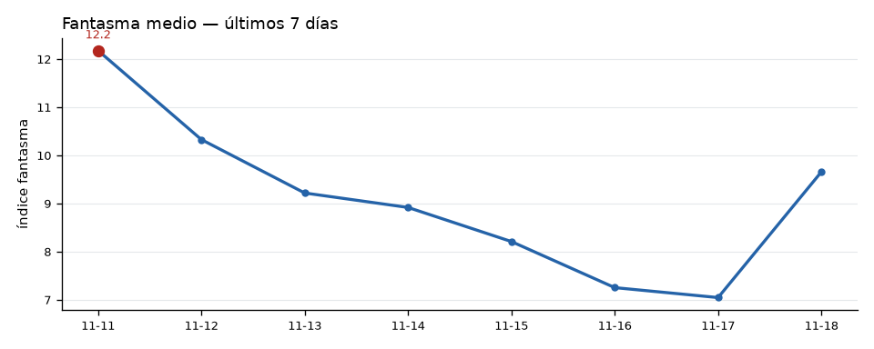

# 🔄 Comparativo diario — 2026-11-15 vs 2026-11-14
*Corte 13:40 hora MX*

| Métrica | Hoy | Ayer | Cambio |
|---|---:|---:|---:|
| Fantasma medio | 8.3 | 8.9 | ▼ -0.6 |
| Fantasma máx | 8.5 | 9.2 | ▼ -0.6 |
| Ciclos corridos | 3 | 4 | ▼ -1 |
| Breaches del Muro | 0 | 0 | ＝ +0 |
| Asertividad viva (resuelta en el día) | — | — | — |
| Patrones cimáticos (total / nuevos 24h) | 2698 | — | +16 |

## ✅ Aciertos — Últimas 24 horas

**No hay predicciones auditadas en este período.**

