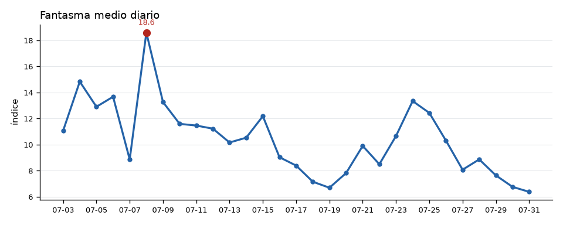
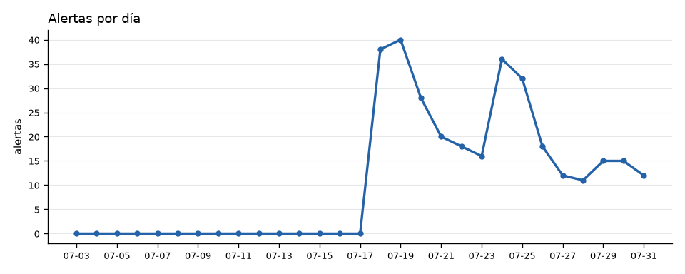
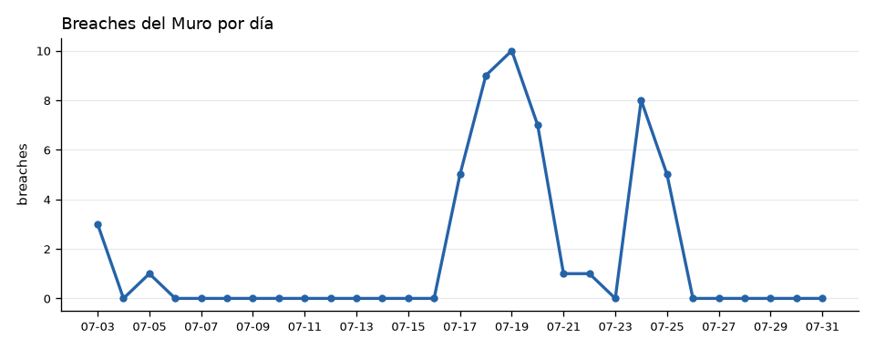

# 🗓️ Reporte mensual — Sentinel Omega
*Generado 2026-07-31 14:00 hora MX — ventana 31 días*

## Resumen
- Ciclos corridos: **333**
- Fantasma medio del periodo: **10.4**
- Fantasma máximo: **25.4**
- Breaches del Muro: **50**
- Asertividad viva del periodo: **43%** (n=5107 resueltas)

## Cimática
- Patrones `general`: 115 (frecuencia máx 6)
- Patrones `nodo`: 326 (frecuencia máx 12)

| Patrón | Ámbito | Evento asociado | Frecuencia |
|---|---|---|---:|
| 163 | nodo 14 | SISMO_M6 | 12 |
| 313 | nodo 14 | SISMO_M6 | 11 |
| 335 | nodo 14 | SISMO_M5 | 7 |
| 152 | nodo 14 | SISMO_M6 | 6 |
| 162 | general | SISMO_M6 | 6 |
| 167 | nodo 14 | SISMO_M5 | 6 |
| 220 | nodo 14 | SISMO_M5 | 6 |
| 311 | general | SISMO_M5 | 6 |
| 178 | nodo 14 | SISMO_M5 | 5 |
| 183 | nodo 14 | SISMO_M5 | 5 |

