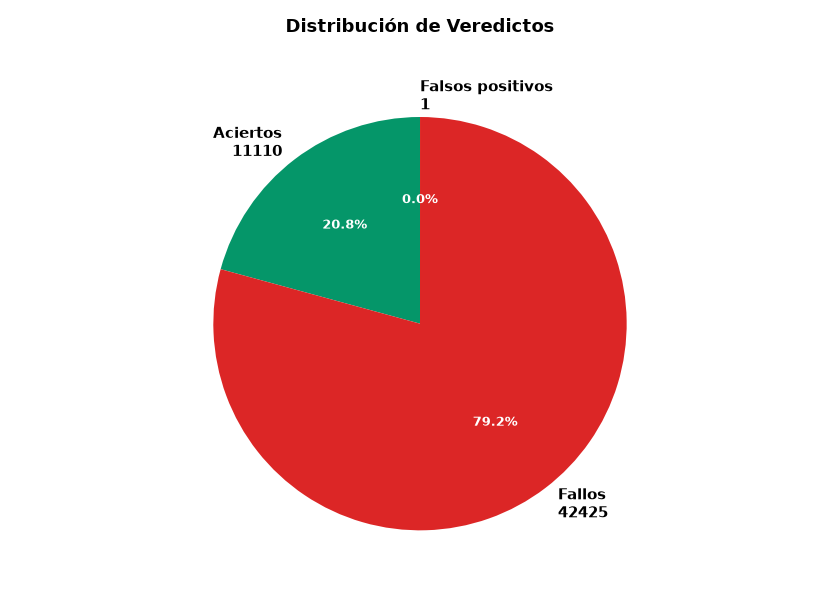
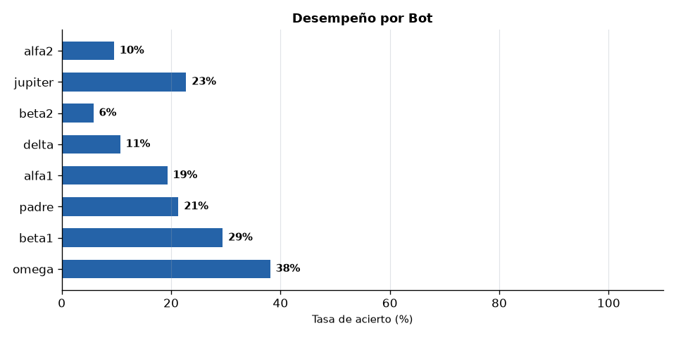
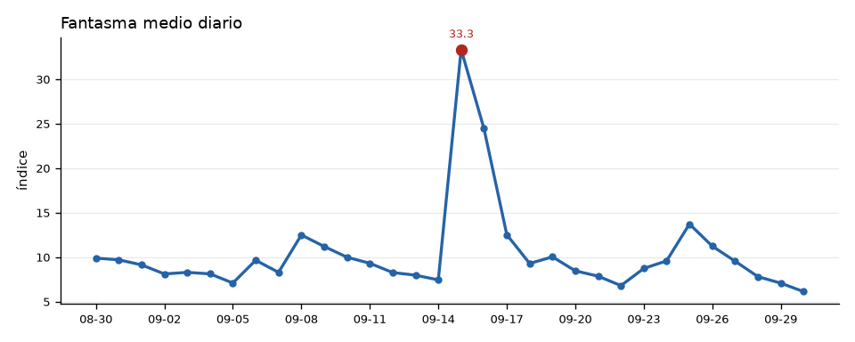
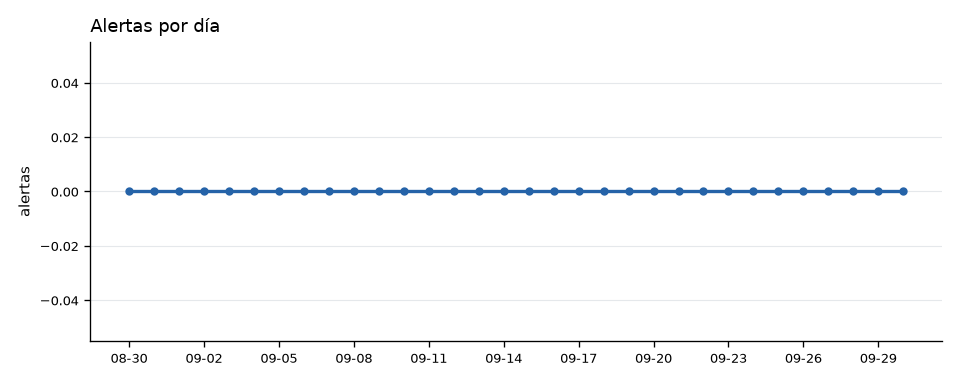
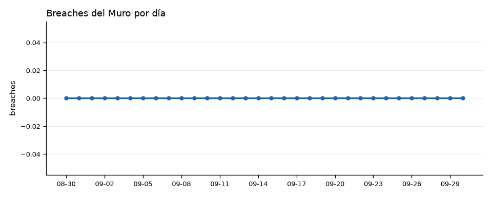

# 🗓️ Reporte mensual — Sentinel Omega
*Generado 2026-09-30 12:41 hora MX — ventana 31 días*

## Resumen
- Ciclos corridos: **283**
- Fantasma medio del periodo: **10.3**
- Fantasma máximo: **61.2**
- Breaches del Muro: **0**
- Asertividad viva del periodo: **11%** (n=1336 resueltas)

## Cimática
- Patrones `general`: 458 (frecuencia máx 10)
- Patrones `nodo`: 1294 (frecuencia máx 15)

| Patrón | Ámbito | Evento asociado | Frecuencia |
|---|---|---|---:|
| 1562 | nodo 35 | SISMO_M5 | 15 |
| 163 | nodo 14 | SISMO_M6 | 12 |
| 313 | nodo 14 | SISMO_M6 | 11 |
| 800 | general | SISMO_M5 | 10 |
| 1568 | nodo 35 | SISMO_M5 | 10 |
| 801 | nodo 48 | SISMO_M5 | 9 |
| 1652 | nodo 14 | SISMO_M5 | 9 |
| 451 | general | SISMO_M6 | 8 |
| 452 | nodo 35 | SISMO_M6 | 8 |
| 456 | nodo 14 | SISMO_M6 | 8 |

## ✅ Aciertos — Últimos 31 días

| Métrica | Valor |
|---------|-------|
| **Aciertos** | 11110 |
| **Fallos** | 42425 |
| **Falsos positivos** | 1 |
| **Tasa de acierto** | 20.8% `▓▓░░░░░░░░░░` |
| **Total predicciones** | 53536 |

### 🤖 Desempeño por Bot

| Bot | Aciertos | Tasa | Confianza | Ventana declarada |
|-----|----------|------|-----------|--------------------|
| omega | 3380/8867 | 38% `▓▓▓░░░░░` | 0.39 | 4.4h |
| beta1 | 2609/8867 | 29% `▓▓░░░░░░` | 0.30 | 4.4h |
| padre | 1892/8867 | 21% `▓▓░░░░░░` | 0.21 | 4.4h |
| alfa1 | 1712/8867 | 19% `▓▓░░░░░░` | 0.20 | 4.4h |
| delta | 948/8867 | 11% `▓░░░░░░░` | 0.11 | 4.4h |
| beta2 | 515/8867 | 6% `░░░░░░░░` | 0.06 | 4.4h |
| jupiter | 38/167 | 23% `▓▓░░░░░░` | 0.26 | 231.3h |
| alfa2 | 16/167 | 10% `▓░░░░░░░` | 0.30 | 231.3h |

