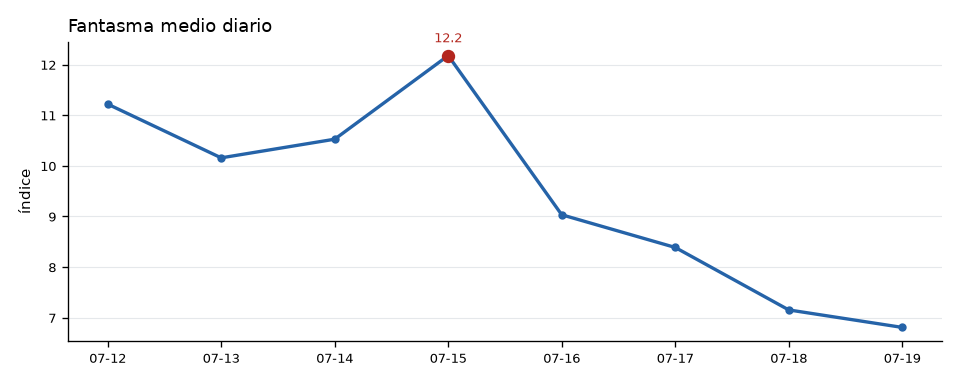
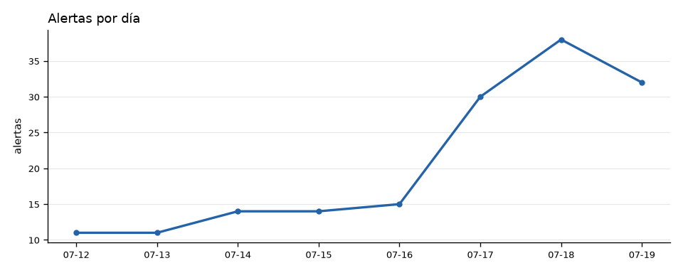
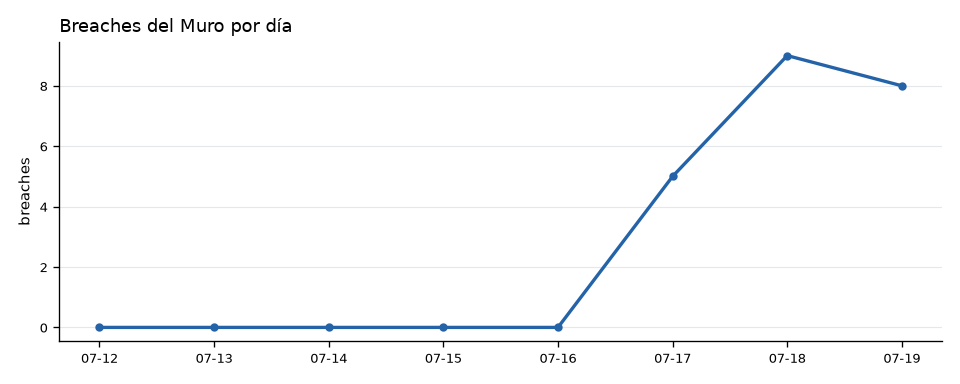

# 📅 Reporte semanal — Sentinel Omega
*Generado 2026-07-19 13:33 hora MX — ventana 7 días*

## Resumen
- Ciclos corridos: **74**
- Fantasma medio del periodo: **9.4**
- Fantasma máximo: **16.7**
- Breaches del Muro: **22**
- Asertividad viva del periodo: **3%** (n=34 resueltas)

## Cimática
- Patrones `general`: 49 (frecuencia máx 4)
- Patrones `nodo`: 137 (frecuencia máx 7)

| Patrón | Ámbito | Evento asociado | Frecuencia |
|---|---|---|---:|
| 163 | nodo 14 | SISMO_M6 | 7 |
| 152 | nodo 14 | SISMO_M6 | 6 |
| 178 | nodo 14 | SISMO_M5 | 5 |
| 183 | nodo 14 | SISMO_M5 | 5 |
| 1 | general | SISMO_M5 | 4 |
| 2 | nodo 57 | SISMO_M5 | 4 |
| 3 | nodo 14 | SISMO_M5 | 4 |
| 4 | nodo 50 | SISMO_M6 | 4 |
| 155 | nodo 14 | SISMO_M5 | 4 |
| 162 | general | SISMO_M6 | 4 |

