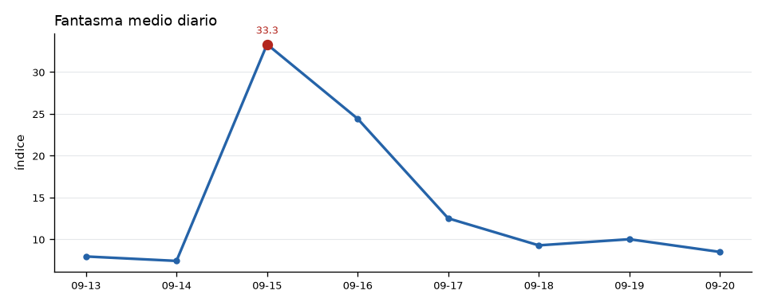
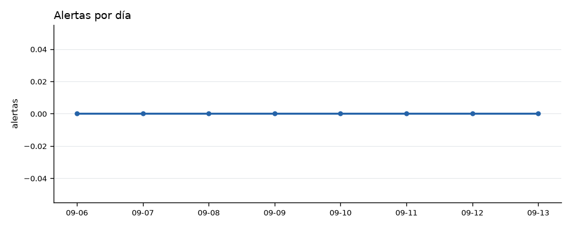
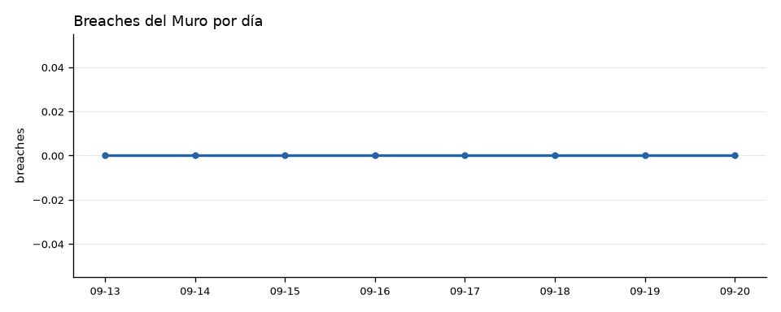

# 📅 Reporte semanal — Sentinel Omega
*Generado 2026-08-16 12:47 hora MX — ventana 7 días*

## Resumen
- Ciclos corridos: **89**
- Fantasma medio del periodo: **10.4**
- Fantasma máximo: **27.5**
- Breaches del Muro: **47**
- Asertividad viva del periodo: **43%** (n=44 resueltas)

## Cimática
- Patrones `general`: 213 (frecuencia máx 9)
- Patrones `nodo`: 598 (frecuencia máx 12)

| Patrón | Ámbito | Evento asociado | Frecuencia |
|---|---|---|---:|
| 163 | nodo 14 | SISMO_M6 | 12 |
| 313 | nodo 14 | SISMO_M6 | 11 |
| 800 | general | SISMO_M5 | 9 |
| 801 | nodo 48 | SISMO_M5 | 9 |
| 451 | general | SISMO_M6 | 8 |
| 452 | nodo 35 | SISMO_M6 | 8 |
| 456 | nodo 14 | SISMO_M6 | 8 |
| 635 | nodo 14 | SISMO_M5 | 8 |
| 335 | nodo 14 | SISMO_M5 | 7 |
| 753 | nodo 14 | SISMO_M5 | 7 |

