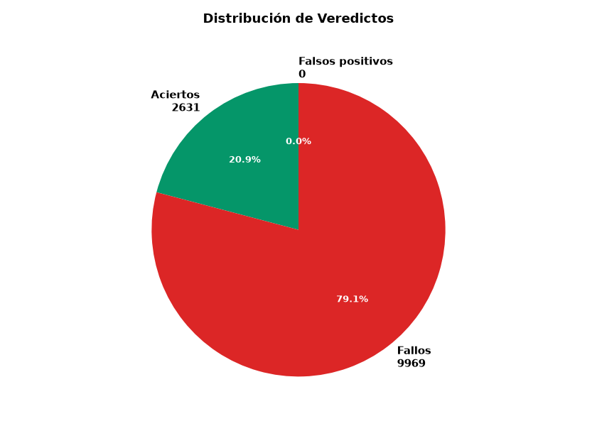
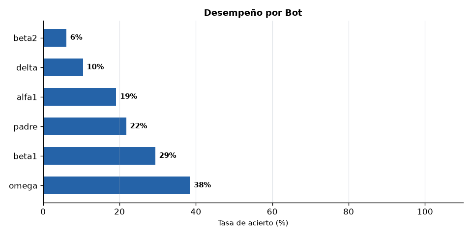

# 📅 Reporte semanal — Sentinel Omega
*Generado 2026-09-20 12:28 hora MX — ventana 7 días*

## Resumen
- Ciclos corridos: **90**
- Fantasma medio del periodo: **14.2**
- Fantasma máximo: **61.2**
- Breaches del Muro: **0**
- Asertividad viva del periodo: **—** (n=0 resueltas)

## Cimática
- Patrones `general`: 397 (frecuencia máx 10)
- Patrones `nodo`: 1113 (frecuencia máx 12)

| Patrón | Ámbito | Evento asociado | Frecuencia |
|---|---|---|---:|
| 163 | nodo 14 | SISMO_M6 | 12 |
| 313 | nodo 14 | SISMO_M6 | 11 |
| 800 | general | SISMO_M5 | 10 |
| 801 | nodo 48 | SISMO_M5 | 9 |
| 451 | general | SISMO_M6 | 8 |
| 452 | nodo 35 | SISMO_M6 | 8 |
| 456 | nodo 14 | SISMO_M6 | 8 |
| 635 | nodo 14 | SISMO_M5 | 8 |
| 973 | nodo 14 | SISMO_M5 | 8 |
| 985 | nodo 14 | SISMO_M5 | 8 |

## ✅ Aciertos — Últimos 7 días

| Métrica | Valor |
|---------|-------|
| **Aciertos** | 2631 |
| **Fallos** | 9969 |
| **Falsos positivos** | 0 |
| **Tasa de acierto** | 20.9% `▓▓▓░░░░░░░░░` |
| **Total predicciones** | 12600 |

### 🤖 Desempeño por Bot

| Bot | Aciertos | Tasa | Confianza | Ventana declarada |
|-----|----------|------|-----------|--------------------|
| omega | 808/2100 | 38% `▓▓▓░░░░░` | 0.39 | 0.0h |
| beta1 | 617/2100 | 29% `▓▓░░░░░░` | 0.29 | 0.0h |
| padre | 457/2100 | 22% `▓▓░░░░░░` | 0.22 | 0.0h |
| alfa1 | 402/2100 | 19% `▓▓░░░░░░` | 0.19 | 0.0h |
| delta | 219/2100 | 10% `▓░░░░░░░` | 0.10 | 0.0h |
| beta2 | 128/2100 | 6% `░░░░░░░░` | 0.06 | 0.0h |

