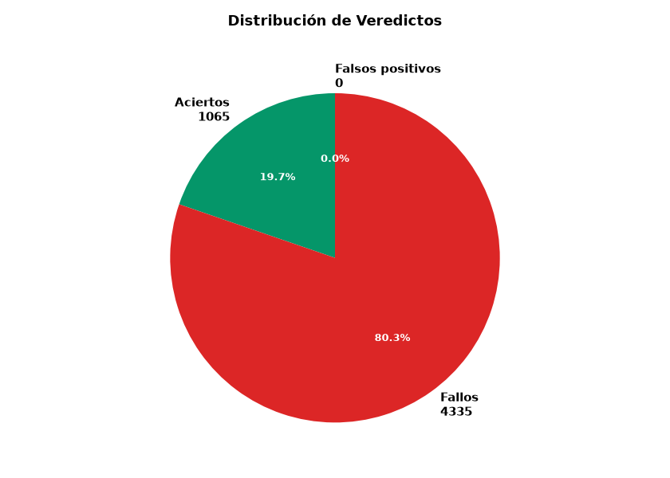
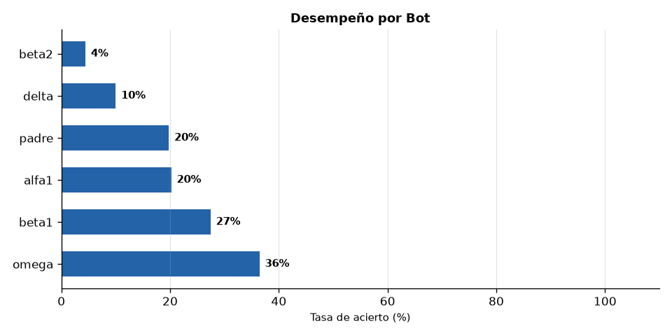
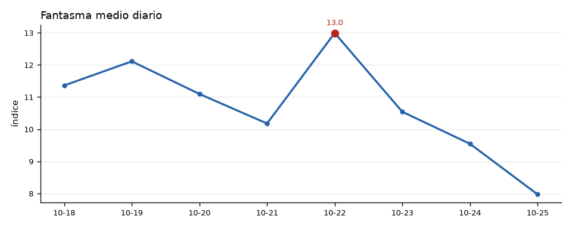
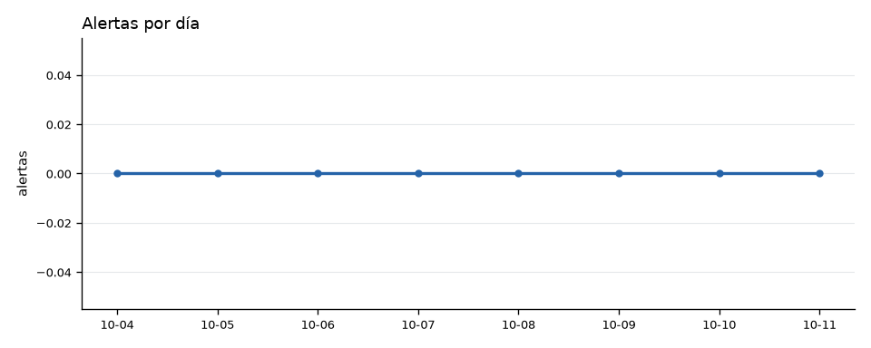
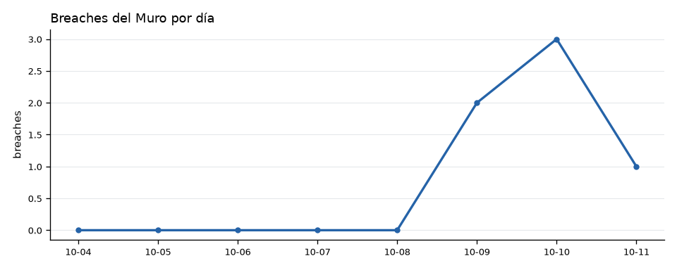

# 📅 Reporte semanal — Sentinel Omega
*Generado 2026-10-25 12:29 hora MX — ventana 7 días*

## Resumen
- Ciclos corridos: **55**
- Fantasma medio del periodo: **10.7**
- Fantasma máximo: **14.9**
- Breaches del Muro: **22**
- Asertividad viva del periodo: **—** (n=0 resueltas)

## Cimática
- Patrones `general`: 622 (frecuencia máx 10)
- Patrones `nodo`: 1808 (frecuencia máx 15)

| Patrón | Ámbito | Evento asociado | Frecuencia |
|---|---|---|---:|
| 1562 | nodo 35 | SISMO_M5 | 15 |
| 163 | nodo 14 | SISMO_M6 | 12 |
| 313 | nodo 14 | SISMO_M6 | 11 |
| 800 | general | SISMO_M5 | 10 |
| 1568 | nodo 35 | SISMO_M5 | 10 |
| 801 | nodo 48 | SISMO_M5 | 9 |
| 1652 | nodo 14 | SISMO_M5 | 9 |
| 451 | general | SISMO_M6 | 8 |
| 452 | nodo 35 | SISMO_M6 | 8 |
| 456 | nodo 14 | SISMO_M6 | 8 |

## ✅ Aciertos — Últimos 7 días

| Métrica | Valor |
|---------|-------|
| **Aciertos** | 1065 |
| **Fallos** | 4335 |
| **Falsos positivos** | 0 |
| **Tasa de acierto** | 19.7% `▓▓░░░░░░░░░░` |
| **Total predicciones** | 5400 |

### 🤖 Desempeño por Bot

| Bot | Aciertos | Tasa | Confianza | Ventana declarada |
|-----|----------|------|-----------|--------------------|
| omega | 328/900 | 36% `▓▓▓░░░░░` | 0.36 | 0.0h |
| beta1 | 247/900 | 27% `▓▓░░░░░░` | 0.27 | 0.0h |
| alfa1 | 182/900 | 20% `▓▓░░░░░░` | 0.20 | 0.0h |
| padre | 178/900 | 20% `▓▓░░░░░░` | 0.20 | 0.0h |
| delta | 90/900 | 10% `▓░░░░░░░` | 0.10 | 0.0h |
| beta2 | 40/900 | 4% `░░░░░░░░` | 0.04 | 0.0h |

