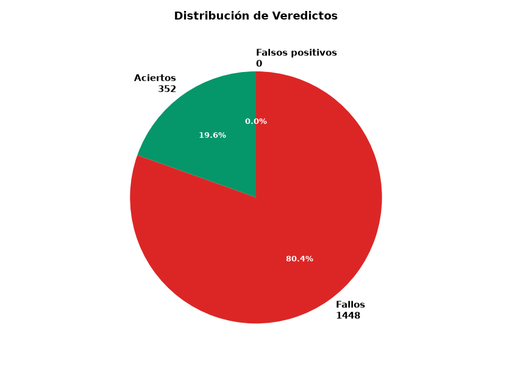
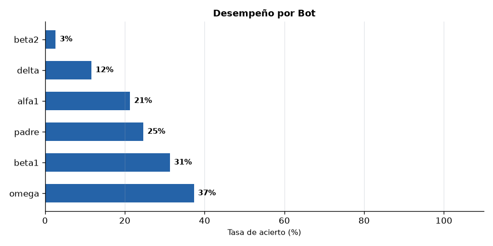
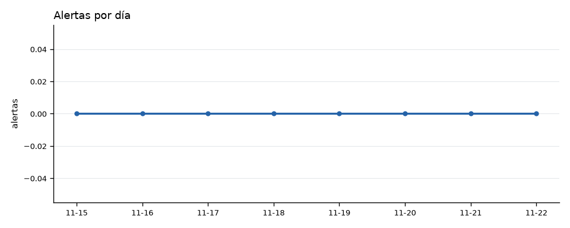

# 📅 Reporte semanal — Sentinel Omega
*Generado 2026-11-22 17:37 hora MX — ventana 7 días*

## Resumen
- Ciclos corridos: **25**
- Fantasma medio del periodo: **8.8**
- Fantasma máximo: **13.4**
- Breaches del Muro: **7**
- Asertividad viva del periodo: **—** (n=0 resueltas)

## Cimática
- Patrones `general`: 710 (frecuencia máx 10)
- Patrones `nodo`: 2070 (frecuencia máx 15)

| Patrón | Ámbito | Evento asociado | Frecuencia |
|---|---|---|---:|
| 1562 | nodo 35 | SISMO_M5 | 15 |
| 163 | nodo 14 | SISMO_M6 | 12 |
| 313 | nodo 14 | SISMO_M6 | 11 |
| 800 | general | SISMO_M5 | 10 |
| 1568 | nodo 35 | SISMO_M5 | 10 |
| 801 | nodo 48 | SISMO_M5 | 9 |
| 1652 | nodo 14 | SISMO_M5 | 9 |
| 451 | general | SISMO_M6 | 8 |
| 452 | nodo 35 | SISMO_M6 | 8 |
| 456 | nodo 14 | SISMO_M6 | 8 |

## ✅ Aciertos — Últimos 7 días

| Métrica | Valor |
|---------|-------|
| **Aciertos** | 1161 |
| **Fallos** | 4239 |
| **Falsos positivos** | 0 |
| **Tasa de acierto** | 21.5% `▓▓▓░░░░░░░░░` |
| **Total predicciones** | 5400 |

### 🤖 Desempeño por Bot

| Bot | Aciertos | Tasa | Confianza | Ventana declarada |
|-----|----------|------|-----------|--------------------|
| omega | 336/900 | 37% `▓▓▓░░░░░` | 0.37 | 0.0h |
| beta1 | 282/900 | 31% `▓▓▓░░░░░` | 0.31 | 0.0h |
| padre | 222/900 | 25% `▓▓░░░░░░` | 0.25 | 0.0h |
| alfa1 | 192/900 | 21% `▓▓░░░░░░` | 0.21 | 0.0h |
| delta | 105/900 | 12% `▓░░░░░░░` | 0.12 | 0.0h |
| beta2 | 24/900 | 3% `░░░░░░░░` | 0.03 | 0.0h |

